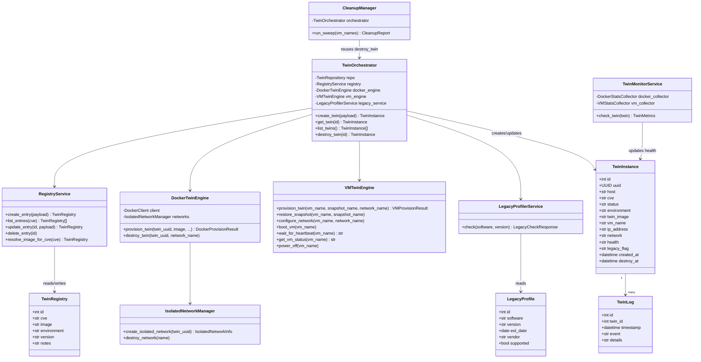

# Class Diagram: Digital Twin Generator

```mermaid
classDiagram
    class TwinInstance {
        +int id
        +UUID uuid
        +str host
        +str cve
        +str status
        +str environment
        +str twin_image
        +str vm_name
        +str ip_address
        +str network
        +str health
        +str legacy_flag
        +datetime created_at
        +datetime destroy_at
    }
    class TwinRegistry {
        +int id
        +str cve
        +str image
        +str environment
        +str version
        +str notes
    }
    class LegacyProfile {
        +int id
        +str software
        +str version
        +date eol_date
        +str vendor
        +bool supported
    }
    class TwinLog {
        +int id
        +int twin_id
        +datetime timestamp
        +str event
        +str details
    }
    TwinInstance "1" --> "many" TwinLog

    class TwinOrchestrator {
        -TwinRepository repo
        -RegistryService registry
        -DockerTwinEngine docker_engine
        -VMTwinEngine vm_engine
        -LegacyProfilerService legacy_service
        +create_twin(payload) TwinInstance
        +get_twin(id) TwinInstance
        +list_twins() TwinInstance[]
        +destroy_twin(id) TwinInstance
    }
    class RegistryService {
        +create_entry(payload) TwinRegistry
        +list_entries(cve) TwinRegistry[]
        +update_entry(id, payload) TwinRegistry
        +delete_entry(id)
        +resolve_image_for_cve(cve) TwinRegistry
    }
    class LegacyProfilerService {
        +check(software, version) LegacyCheckResponse
    }
    class DockerTwinEngine {
        -DockerClient client
        -IsolatedNetworkManager networks
        +provision_twin(twin_uuid, image, ...) DockerProvisionResult
        +destroy_twin(twin_uuid, network_name)
    }
    class IsolatedNetworkManager {
        +create_isolated_network(twin_uuid) IsolatedNetworkInfo
        +destroy_network(name)
    }
    class VMTwinEngine {
        +provision_twin(vm_name, snapshot_name, network_name) VMProvisionResult
        +restore_snapshot(vm_name, snapshot_name)
        +configure_network(vm_name, network_name)
        +boot_vm(vm_name)
        +wait_for_heartbeat(vm_name) str
        +get_vm_status(vm_name) str
        +power_off(vm_name)
    }
    class TwinMonitorService {
        -DockerStatsCollector docker_collector
        -VMStatsCollector vm_collector
        +check_twin(twin) TwinMetrics
    }
    class CleanupManager {
        -TwinOrchestrator orchestrator
        +run_sweep(vm_names) CleanupReport
    }

    TwinOrchestrator --> RegistryService
    TwinOrchestrator --> DockerTwinEngine
    TwinOrchestrator --> VMTwinEngine
    TwinOrchestrator --> LegacyProfilerService
    TwinOrchestrator --> TwinInstance : creates/updates
    DockerTwinEngine --> IsolatedNetworkManager
    RegistryService --> TwinRegistry : reads/writes
    LegacyProfilerService --> LegacyProfile : reads
    TwinMonitorService --> TwinInstance : updates health
    CleanupManager --> TwinOrchestrator : reuses destroy_twin
```
