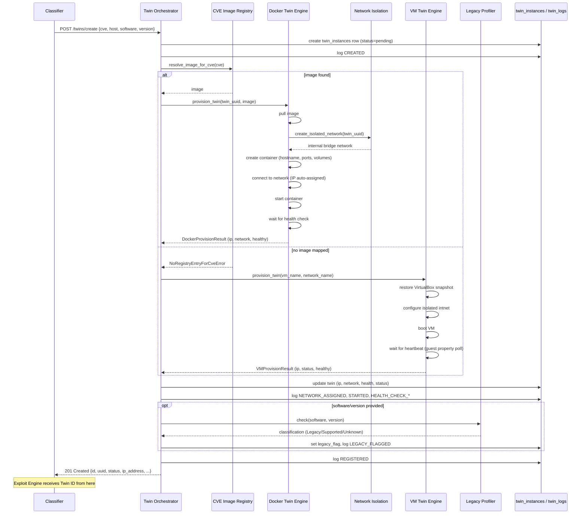
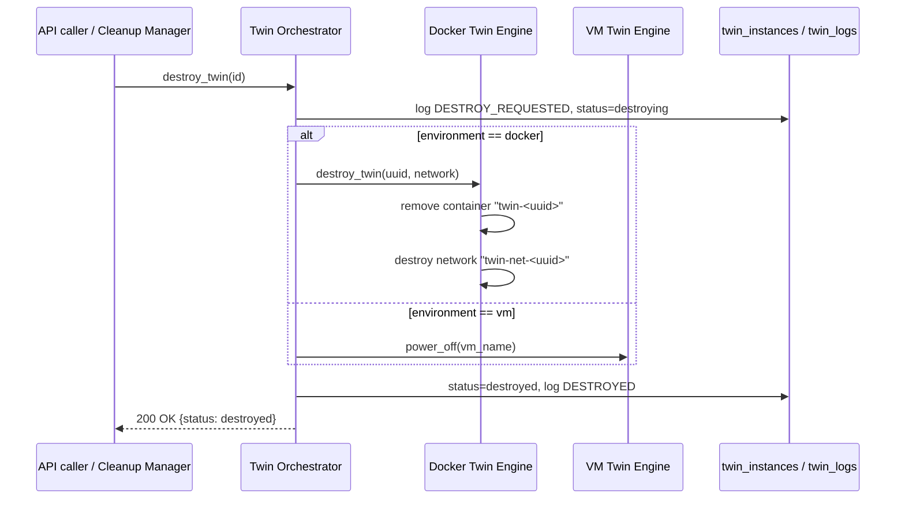

# Sequence Diagram: Twin Creation

```mermaid
sequenceDiagram
    participant Classifier
    participant Orchestrator as Twin Orchestrator
    participant Registry as CVE Image Registry
    participant Docker as Docker Twin Engine
    participant NetIso as Network Isolation
    participant VM as VM Twin Engine
    participant Legacy as Legacy Profiler
    participant DB as twin_instances / twin_logs

    Classifier->>Orchestrator: POST /twins/create {cve, host, software, version}
    Orchestrator->>DB: create twin_instances row (status=pending)
    Orchestrator->>DB: log CREATED

    Orchestrator->>Registry: resolve_image_for_cve(cve)
    alt image found
        Registry-->>Orchestrator: image
        Orchestrator->>Docker: provision_twin(twin_uuid, image)
        Docker->>Docker: pull image
        Docker->>NetIso: create_isolated_network(twin_uuid)
        NetIso-->>Docker: internal bridge network
        Docker->>Docker: create container (hostname, ports, volumes)
        Docker->>Docker: connect to network (IP auto-assigned)
        Docker->>Docker: start container
        Docker->>Docker: wait for health check
        Docker-->>Orchestrator: DockerProvisionResult (ip, network, healthy)
    else no image mapped
        Registry-->>Orchestrator: NoRegistryEntryForCveError
        Orchestrator->>VM: provision_twin(vm_name, network_name)
        VM->>VM: restore VirtualBox snapshot
        VM->>VM: configure isolated intnet
        VM->>VM: boot VM
        VM->>VM: wait for heartbeat (guest property poll)
        VM-->>Orchestrator: VMProvisionResult (ip, status, healthy)
    end

    Orchestrator->>DB: update twin (ip, network, health, status)
    Orchestrator->>DB: log NETWORK_ASSIGNED, STARTED, HEALTH_CHECK_*

    opt software/version provided
        Orchestrator->>Legacy: check(software, version)
        Legacy-->>Orchestrator: classification (Legacy/Supported/Unknown)
        Orchestrator->>DB: set legacy_flag, log LEGACY_FLAGGED
    end

    Orchestrator->>DB: log REGISTERED
    Orchestrator-->>Classifier: 201 Created {id, uuid, status, ip_address, ...}
    Note over Classifier: Exploit Engine receives Twin ID from here
```

## Sequence Diagram: Twin Destruction (manual or Cleanup Manager)

```mermaid
sequenceDiagram
    participant Caller as API caller / Cleanup Manager
    participant Orchestrator as Twin Orchestrator
    participant Docker as Docker Twin Engine
    participant VM as VM Twin Engine
    participant DB as twin_instances / twin_logs

    Caller->>Orchestrator: destroy_twin(id)
    Orchestrator->>DB: log DESTROY_REQUESTED, status=destroying
    alt environment == docker
        Orchestrator->>Docker: destroy_twin(uuid, network)
        Docker->>Docker: remove container "twin-<uuid>"
        Docker->>Docker: destroy network "twin-net-<uuid>"
    else environment == vm
        Orchestrator->>VM: power_off(vm_name)
    end
    Orchestrator->>DB: status=destroyed, log DESTROYED
    Orchestrator-->>Caller: 200 OK {status: destroyed}
```
